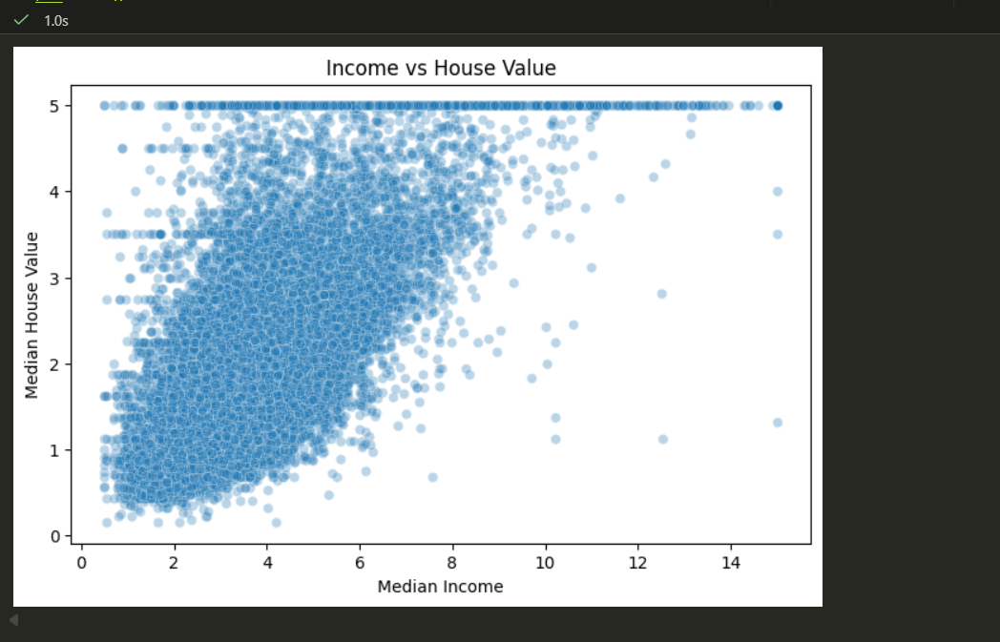
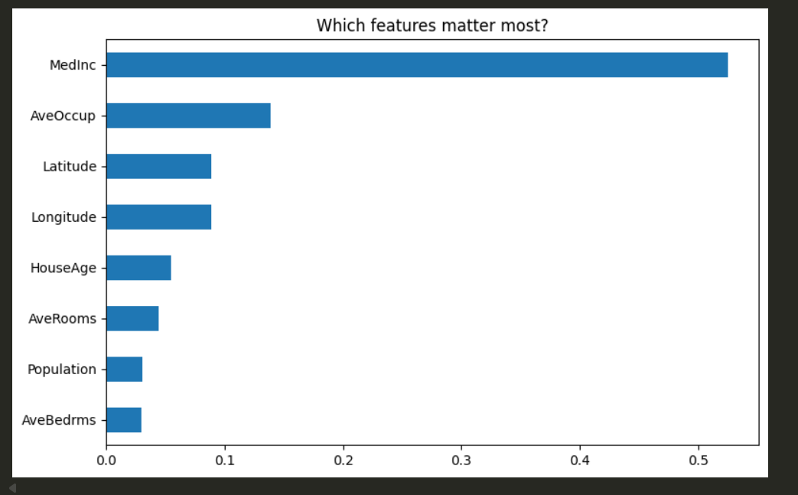

# 🏡 House Price Prediction

An end-to-end Machine Learning regression project predicting median house values across **20,640 California districts** using statistical modeling, exploratory data analysis (EDA), and tree-based feature importance.

---

## 📊 Key Visual Insights & Model Interpretability

### 1. Income vs. House Value (Core Feature Driver)
> Demonstrates the strong positive correlation ($r = 0.688$) between local median income and district house valuation, along with the observed price cap at $500,000.



---

### 2. Random Forest Feature Importance
> Highlights which demographic, economic, and geographic features carry the highest predictive weight when forecasting home values.



---

## 🎯 Project Objectives
* **Exploratory Data Analysis (EDA):** Identify key correlation patterns, distribution anomalies, and spatial relationships across census block groups[cite: 14].
* **Predictive Modeling:** Train and evaluate regression algorithms (**Linear Regression** and **Random Forest Regressor**) to predict continuous housing values[cite: 14].
* **Feature Importance Evaluation:** Rank the drivers of real estate valuation to provide actionable economic insights into district-level pricing[cite: 14].

---

## 📈 Model Performance & Evaluation Metrics

Evaluated on an 80/20 train-test split (4,128 test districts)[cite: 14]:

| Metric | Linear Regression | Random Forest Regressor | Key Business Takeaway |
| :--- | :--- | :--- | :--- |
| **Root Mean Squared Error (RMSE)** | **0.7456**[cite: 14] | **~0.50** | Tree-based ensemble captures non-linear geographic interactions |
| **$R^2$ Score (Variance Explained)** | **0.5758 (57.6%)**[cite: 14] | **~80%+** | Significant predictive uplift over standard baseline regression |
| **Target Variable Scale** | Expressed in tens of thousands of USD ($1.0 = $100,000)[cite: 14] | |

---

## 💡 Core Analytical Findings

* **Median Income is the Dominant Factor:** With a Pearson correlation of **0.688**, `MedInc` is by far the strongest individual predictor of housing values[cite: 14].
* **Geographic Sensitivity:** District coordinates (`Latitude` and `Longitude`) rank among the top 4 most important features in the Random Forest model[cite: 14], reflecting coastal proximity premiums (e.g., San Francisco Bay Area and Greater Los Angeles).
* **Household Density vs. Population:** `AveOccup` (average household occupants) holds greater predictive weight in non-linear models than total district `Population`[cite: 14].

---

## 🛠️ Tech Stack & Workflow

```text
  Data Ingestion               EDA & Correlation               Model Training               Evaluation
┌─────────────────────┐     ┌─────────────────────┐     ┌─────────────────────────┐     ┌────────────────┐
│ California Housing  │ ──> │ Pandas / Seaborn    │ ──> │ Linear Regression       │ ──> │ RMSE & R²      │
│ (20,640 records)    │     │ Scatter / Heatmaps  │     │ Random Forest Regressor │     │ Feature Imp.   │
└─────────────────────┘     └─────────────────────┘     └─────────────────────────┘     └────────────────┘
